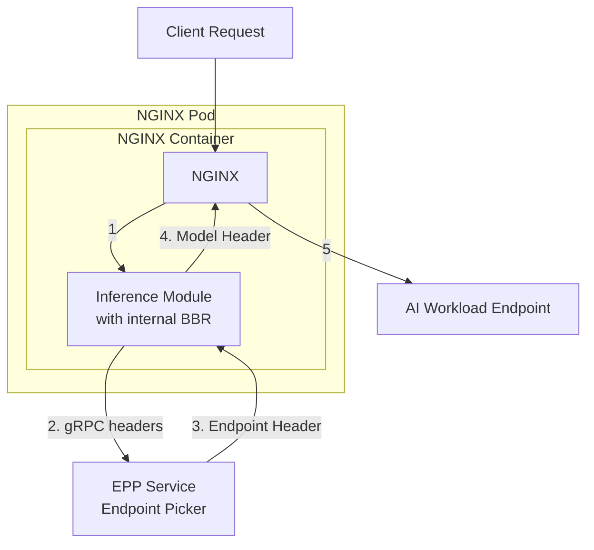

ngx-inference: NGINX module for Gateway API Inference Extensions
=============================================================================

Overview
--------
This project provides a native NGINX module (built with ngx-rust) that implements the Gateway API Inference Extension using Envoy's `ext_proc` protocol over gRPC.

It implements two standard components:
- **Endpoint Picker Processor (EPP)**: Headers-only exchange following the Gateway API Inference Extension specification to obtain upstream endpoint selection and expose endpoints via the `$inference_upstream` NGINX variable.
- **Body-Based Routing (BBR)**: Direct in-module implementation that extracts model names from JSON request bodies and injects model headers, following the OpenAI API specification and Gateway API Inference Extension standards.

Reference docs:
- NGF design doc: https://github.com/nginx/nginx-gateway-fabric/blob/main/docs/proposals/gateway-inference-extension.md
- EPP reference implementation: https://github.com/kubernetes-sigs/gateway-api-inference-extension/tree/main/pkg/epp

Current behavior and defaults
-----------------------------
- BBR:
  - Directive `inference_bbr on|off` enables/disables direct BBR implementation.
  - BBR follows the Gateway API specification: parses JSON request bodies directly for the "model" field and sets the model header.
  - Directive `inference_bbr_header_name` configures the model header name to inject (default `X-Gateway-Model-Name`).
  - Directive `inference_bbr_max_body_size` sets maximum body size for BBR processing in bytes (default 10MB).
  - Directive `inference_bbr_default_model` sets the default model value when no model is found in request body (default `unknown`).
  - Hybrid memory/file support: small bodies stay in memory, large bodies are read from NGINX temporary files.
  - Memory allocation is capped at 1MB regardless of body size to prevent excessive memory usage.

- EPP:
  - Directive `inference_epp on|off` enables/disables EPP functionality.
  - Directive `inference_epp_endpoint` sets the gRPC endpoint for standard EPP ext-proc server communication.
  - Directive `inference_epp_header_name` configures the upstream header name to read from EPP responses (default `X-Inference-Upstream`).
  - EPP follows the Gateway API Inference Extension specification: performs headers-only exchange, reads header mutations from responses, and sets the upstream header for endpoint selection.
  - The `$inference_upstream` NGINX variable exposes the EPP-selected endpoint and can be used in `proxy_pass` directives.

- Fail-open/closed:
  - `inference_bbr_failure_mode_allow on|off` and `inference_epp_failure_mode_allow on|off` control whether to fail-open when the ext-proc is unavailable or errors. Fail-closed returns `502 Bad Gateway`.

NGINX configuration
-------------------
Example configuration snippet for a location using BBR followed by EPP:
```
# Load the compiled module (path depends on your build output)
load_module /usr/lib/nginx/modules/libngx_inference.so;

http {
    server {
        listen 8080;

        # OpenAI-like API endpoint with both EPP and BBR
        location /responses {
            # Configure the inference module for direct BBR processing
            inference_bbr on;
            inference_bbr_max_body_size 52428800; # 50MB for AI workloads
            inference_bbr_default_model "gpt-3.5-turbo"; # Default model when none found

            # Configure the inference module for EPP (Endpoint Picker Processor)
            inference_epp on;
            inference_epp_endpoint "mock-epp:9001"; # Docker Compose service name (previously container_name extproc-epp)
            inference_epp_timeout_ms 5000;

            # Proxy to the chosen upstream (will be determined by EPP)
            # Use the $inference_upstream variable set by the EPP module
            proxy_set_header Host $host;
            proxy_set_header X-Real-IP $remote_addr;
            proxy_set_header X-Forwarded-For $proxy_add_x_forwarded_for;
            proxy_pass http://$inference_upstream;
        }
    }
}
```

Notes and assumptions
---------------------
- **Standards Compliance**:
  - Both EPP and BBR implementations follow the Gateway API Inference Extension specification.
  - EPP is compatible with reference EPP servers for endpoint selection.
  - BBR is compatible with the OpenAI API specification for model detection from JSON request bodies.

- Header names:
  - BBR returns and injects a model header (default `X-Gateway-Model-Name`). You can configure this via `inference_bbr_header_name`.
  - EPP should return an endpoint hint via header mutation. This module reads a configurable upstream header via `inference_epp_header_name` (default `X-Inference-Upstream`) and exposes its value as `$inference_upstream`.

- TLS:
  - Current implementation uses insecure/plaintext gRPC channels. The EPP project notes TLS support is a known issue still under discussion. Once TLS configuration is available, this module can be extended to support secure gRPC channels.

- Body processing:
  - EPP follows the standard Gateway API specification with headers-only mode (no body streaming).
  - BBR implements hybrid memory/file processing: small bodies (< client_body_buffer_size) stay in memory, larger bodies are read from NGINX temporary files.
  - Memory allocation is capped at 1MB to prevent excessive memory usage regardless of request body size.
  - BBR respects configurable size limits via `inference_bbr_max_body_size` directive.

- Request headers to ext-proc:
  - EPP implementation forwards incoming request headers per the Gateway API specification for endpoint selection context.
  - BBR implementation processes request bodies directly for model detection without external communication.


Inference Module Architecture
-------


Testing
-------

### Quick Start with Docker Compose

The project includes a complete testing environment with Docker Compose that sets up:
- NGINX with the ngx-inference module loaded
- Mock external processors for both BBR and EPP
- Echo server as upstream target

1. **Start the test environment:**
   ```bash
   docker-compose up --build
   ```

2. **Test EPP (Endpoint Picker Processor):**
   ```bash
   # Headers-only request - EPP selects upstream based on headers
   curl -i http://localhost:8081/epp-test \
     -H "Content-Type: application/json" \
     -H "X-Request-Id: test-epp-123"
   ```

3. **Test BBR (Body-Based Routing) with JSON model detection:**
   ```bash
   # Request with JSON body - BBR extracts model name from "model" field
   curl -i http://localhost:8081/bbr-test \
     -H "Content-Type: application/json" \
     -d '{"model": "gpt-4", "prompt": "Hello world", "temperature": 0.7}'
   ```

4. **Test BBR with fallback model:**
   ```bash
   # JSON without "model" field - BBR uses configured fallback
   curl -i http://localhost:8081/bbr-test \
     -H "Content-Type: application/json" \
     -d '{"prompt": "Hello world", "temperature": 0.7}'
   ```

5. **Test combined BBR + EPP pipeline:**
   ```bash
   # JSON with model field - both BBR and EPP process the request
   curl -i http://localhost:8081/responses \
     -H "Content-Type: application/json" \
     -H "X-Client-Id: mobile-app" \
     -d '{"model": "claude-3", "messages": [{"role": "user", "content": "Hello"}]}'
   ```

### Expected Response Headers

When testing, you should see these headers in the echo server response indicating successful processing:

- `x-gateway-model-name` - Set by BBR based on JSON "model" field
- `x-inference-upstream` - Set by EPP for upstream selection
- Original request headers forwarded to the upstream

### Test Environment Components

The Docker Compose stack includes:

- **nginx** (port 8081) - NGINX with ngx-inference module
- **extproc-epp** (internal port 9001) - Mock EPP external processor
- **echo-server** (internal port 80) - Target upstream that echoes request details

### Manual Testing Setup

If you prefer to test without Docker:

1. **Build the module:**
   ```bash
   cargo build --features "vendored,export-modules" --release
   ```

2. **Start mock external processors:**
   ```bash
   # Terminal 1: BBR mock (port 9000)
   EPP_UPSTREAM=localhost:8080 BBR_MODEL=test-model MOCK_ROLE=BBR \
     cargo run --bin extproc_mock --features extproc-mock -- 0.0.0.0:9000

   # Terminal 2: EPP mock (port 9001)
   EPP_UPSTREAM=localhost:8080 MOCK_ROLE=EPP \
     cargo run --bin extproc_mock --features extproc-mock -- 0.0.0.0:9001

   # Terminal 3: Simple upstream server
   python3 -m http.server 8080
   ```

3. **Configure and start NGINX:**
   ```nginx
   load_module /path/to/target/release/libngx_inference.so;
   # ... rest of configuration similar to docker/nginx.conf
   ```

### Troubleshooting Tests

- **502 Bad Gateway:** Check if external processors are running and reachable
  - Enable fail-open mode: `inference_*_failure_mode_allow on`
  - Verify endpoints: `inference_bbr_endpoint` and `inference_epp_endpoint`

- **Headers not set:**
  - Check external processor logs for JSON parsing errors
  - Verify Content-Type is `application/json` for BBR tests
  - Ensure JSON contains valid "model" field for BBR

- **DNS resolution errors:**
  - In Docker: Use service names (`extproc-bbr:9000`)
  - Local testing: Use `localhost` or `127.0.0.1`
  - Check NGINX resolver configuration

- **Module not loading:**
  - Verify dynamic library path in `load_module` directive
  - Check NGINX error log for loading errors
  - Ensure library was built with `export-modules` feature

Troubleshooting
---------------
- If EPP endpoints are unreachable or not listening on gRPC, you may see `BAD_GATEWAY` when failure mode allow is off. Toggle `*_failure_mode_allow on` to fail-open during testing.
- Ensure your EPP implementation is configured to return a header mutation for the upstream endpoint. The module will parse response frames and search for `header_mutation` entries.
- BBR processes JSON directly in the module - ensure request bodies contain valid JSON with a "model" field.
- Use `error_log` and debug logging to verify module activation. The access-phase handler logs `ngx-inference: bbr_enable=<..> epp_enable=<..>` per request.

Roadmap
-------
- Validate EPP and BBR implementations against Gateway API Inference Extension conformance tests.
- Align exact header names and semantics to the upstream specification and reference implementations.
- Add configurable maximum body size and back-pressure handling for BBR.
- TLS support for gRPC once available in the Gateway API specification.
- Connection pooling and caching for improved performance at scale.

License
-------
Apache-2.0 (to align with upstream projects).
