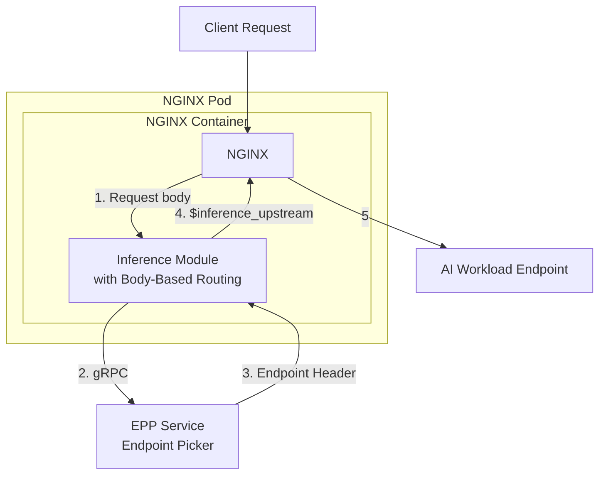

ngx-inference: NGINX module for Gateway API Inference Extensions
=============================================================================

Overview
--------
This project provides a native NGINX module (built with ngx-rust) that implements the Gateway API Inference Extension using Envoy's `ext_proc` protocol over gRPC.

It implements two standard components:
- **Endpoint Picker Processor (EPP)**: Headers-only exchange following the Gateway API Inference Extension specification to obtain upstream endpoint selection and expose endpoints via the `$inference_upstream` NGINX variable.
- **Body-Based Routing (BBR)**: Direct in-module implementation that extracts model names from JSON request bodies and injects model headers, following the OpenAI API specification and Gateway API Inference Extension standards.

Reference docs:
- NGF design doc: https://github.com/nginx/nginx-gateway-fabric/blob/main/docs/proposals/gateway-inference-extension.md
- EPP reference implementation: https://github.com/kubernetes-sigs/gateway-api-inference-extension/tree/main/pkg/epp
- Module configuration: [docs/configuration.md](docs/configuration.md)
- Example configurations: [docs/examples/README.md](docs/examples/README.md)

Current behavior and defaults
-----------------------------
- BBR:
  - Directive `inference_bbr on|off` enables/disables direct BBR implementation.
  - BBR follows the Gateway API specification: parses JSON request bodies directly for the "model" field and sets the model header.
  - Directive `inference_bbr_header_name` configures the model header name to inject (default `X-Gateway-Model-Name`).
  - Directive `inference_bbr_max_body_size` sets maximum body size for BBR processing in bytes (default 10MB).
  - Directive `inference_bbr_default_model` sets the default model value when no model is found in request body (default `unknown`).
  - Hybrid memory/file support: small bodies stay in memory, large bodies are read from NGINX temporary files.
  - Memory allocation pre-allocation is capped at 1MB to avoid large upfront allocations. Actual in-memory accumulation may grow up to the configured `inference_bbr_max_body_size` limit; large payloads spill to disk and are read incrementally.

- EPP:
  - Directive `inference_epp on|off` enables/disables EPP functionality.
  - Directive `inference_epp_endpoint` sets the gRPC endpoint for standard EPP ext-proc server communication.
  - Directive `inference_epp_header_name` configures the upstream header name to read from EPP responses (default `X-Inference-Upstream`).
  - Directive `inference_epp_timeout_ms` sets the gRPC timeout for EPP communication (default `200ms`).
  - EPP follows the Gateway API Inference Extension specification: performs headers-only exchange, reads header mutations from responses, and sets the upstream header for endpoint selection.
  - The `$inference_upstream` NGINX variable exposes the EPP-selected endpoint (read from the header configured by `inference_epp_header_name`) and can be used in `proxy_pass` directives.

- Fail-open/closed:
  - `inference_bbr_failure_mode_allow on|off` and `inference_epp_failure_mode_allow on|off` control fail-open vs fail-closed behavior.
  - In fail-closed mode, BBR enforces size limits and may return `413 Request Entity Too Large` or `500 Internal Server Error` on processing errors; EPP failures return `502 Bad Gateway`.
  - In fail-open mode, processing continues without terminating the request.

NGINX configuration
-------------------
Example configuration snippet for a location using BBR followed by EPP:
```nginx
# Load the compiled module (Linux: .so path; macOS local build: .dylib)
load_module /usr/lib/nginx/modules/libngx_inference.so;

http {
    server {
        listen 8080;

        # OpenAI-like API endpoint with both EPP and BBR
        location /responses {
            # Configure the inference module for direct BBR processing
            inference_bbr on;
            inference_bbr_max_body_size 52428800; # 50MB for AI workloads
            inference_bbr_default_model "gpt-3.5-turbo"; # Default model when none found

            # Configure the inference module for EPP (Endpoint Picker Processor)
            inference_epp on;
            inference_epp_endpoint "mock-epp:9001"; # Docker Compose service name (previously container_name extproc-epp)
            inference_epp_timeout_ms 5000;

            # Proxy to the chosen upstream (will be determined by EPP)
            # Use the $inference_upstream variable set by the EPP module
            proxy_set_header Host $host;
            proxy_set_header X-Real-IP $remote_addr;
            proxy_set_header X-Forwarded-For $proxy_add_x_forwarded_for;
            proxy_pass http://$inference_upstream;
        }
    }
}
```

Notes and assumptions
---------------------
- **Standards Compliance**:
  - Both EPP and BBR implementations follow the Gateway API Inference Extension specification.
  - EPP is compatible with reference EPP servers for endpoint selection.
  - BBR is compatible with the OpenAI API specification for model detection from JSON request bodies.

- Header names:
  - BBR returns and injects a model header (default `X-Gateway-Model-Name`). You can configure this via `inference_bbr_header_name`.
  - EPP should return an endpoint hint via header mutation. This module reads a configurable upstream header via `inference_epp_header_name` (default `X-Inference-Upstream`) and exposes its value as `$inference_upstream`.

- TLS:
  - Current implementation uses insecure/plaintext gRPC channels. The EPP project notes TLS support is a known issue still under discussion. Once TLS configuration is available, this module can be extended to support secure gRPC channels.

- Body processing:
  - EPP follows the standard Gateway API specification with headers-only mode (no body streaming).
  - BBR implements hybrid memory/file processing: small bodies (< client_body_buffer_size) stay in memory, larger bodies are read from NGINX temporary files.
  - Memory allocation pre-allocation is capped at 1MB to avoid large upfront allocations. Actual in-memory accumulation may grow up to the configured `inference_bbr_max_body_size` limit; large payloads spill to disk and are read incrementally.
  - BBR respects configurable size limits via `inference_bbr_max_body_size` directive.

- Request headers to ext-proc:
  - EPP implementation forwards incoming request headers per the Gateway API specification for endpoint selection context.
  - BBR implementation processes request bodies directly for model detection without external communication.


Inference Module Architecture
-------


Testing
-------

For comprehensive testing information, examples, and troubleshooting guides, see [tests/README.md](tests/README.md).

### Local Development Setup

For local development and testing without Docker:

1. **Setup local environment and build the module:**
   ```bash
   # Setup local development environment
   make setup-local

   # Build the module
   make build
   ```

2. **Start local services and run tests:**
   ```bash
   # Start local mock services (echo server on :8080 and mock ext-proc on :9001).
   # NGINX is started automatically by 'make test-local'.
   make start-local

   # Run configuration tests locally
   make test-local
   ```

Troubleshooting
---------------
- If EPP endpoints are unreachable or not listening on gRPC, you may see `BAD_GATEWAY` when failure mode allow is off. Toggle `*_failure_mode_allow on` to fail-open during testing.
- Ensure your EPP implementation is configured to return a header mutation for the upstream endpoint. The module will parse response frames and search for `header_mutation` entries.
- BBR processes JSON directly in the module - ensure request bodies contain valid JSON with a "model" field.
- Use `error_log` and debug logging to verify module activation. BBR logs body reading and size limit enforcement; EPP logs gRPC errors. Set `error_log` to `debug` to observe processing details.

Roadmap
-------
- Validate EPP and BBR implementations against Gateway API Inference Extension conformance tests.
- Align exact header names and semantics to the upstream specification and reference implementations.
- Validate large body handling and back-pressure for BBR; refine chunked reads/writes and resource usage for very large payloads.
- TLS support for gRPC once available in the Gateway API specification.
- Connection pooling and caching for improved performance at scale.

License
-------
Apache-2.0 (to align with upstream projects).
