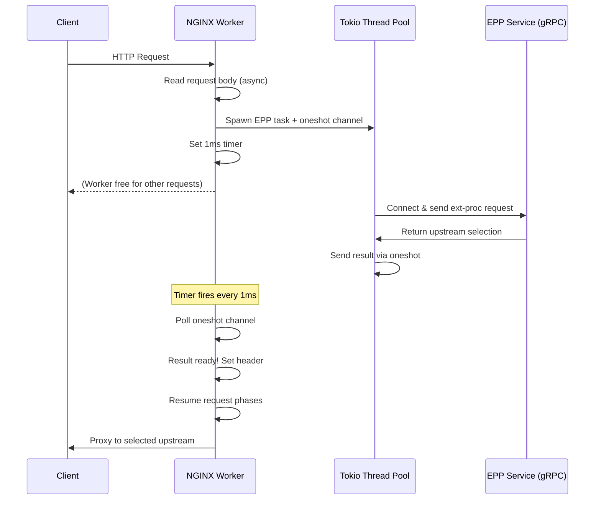
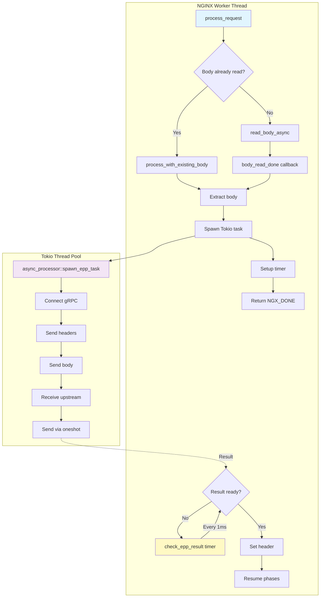
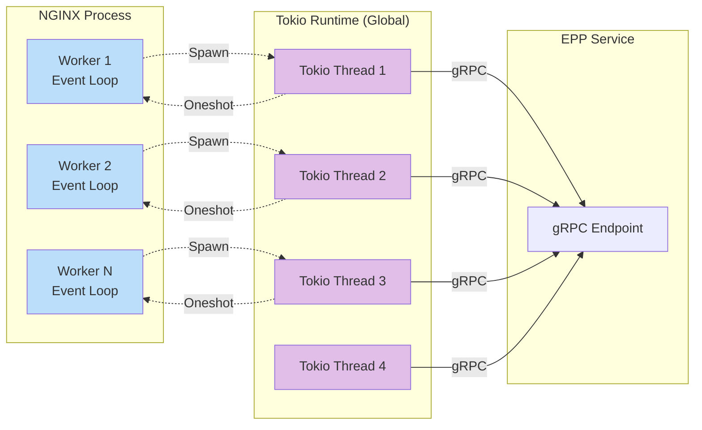
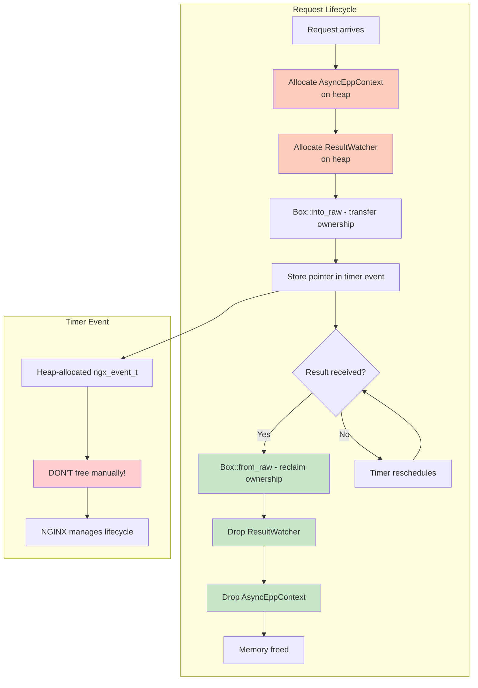
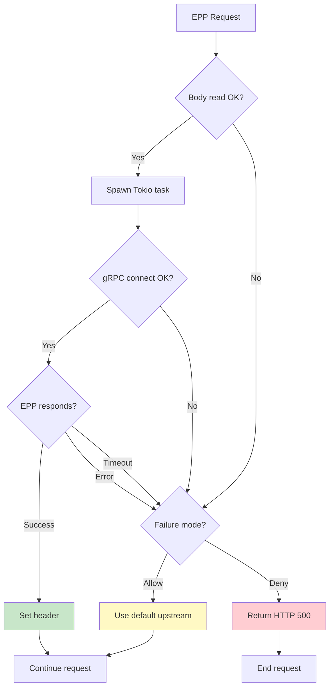

# EPP Async Architecture

## Overview

The EPP (Endpoint Picker Processor) module implements fully asynchronous, non-blocking request processing in NGINX using a Tokio runtime. This allows NGINX workers to remain responsive while gRPC calls happen in parallel on separate threads.

## Architecture Goals

- **Non-blocking**: NGINX workers never block on I/O operations
- **High throughput**: Support 10,000+ concurrent EPP requests
- **Thread safety**: All NGINX FFI calls only happen in worker context
- **Low overhead**: <1MB memory per pending request
- **Fail-safe**: Configurable fail-open/fail-closed modes

## High-Level Flow



## Component Architecture



## Threading Model



## Memory Management



## Critical Design Decisions

### 1. Timer-Based Polling vs Event Notification

**Decision**: Use 1ms timer polling with `try_recv()` on oneshot channel

**Rationale**:
- NGINX doesn't expose cross-thread notification API in ngx-rust
- Tokio threads cannot call NGINX FFI functions directly (thread safety)
- 1ms overhead is negligible compared to gRPC latency (50-100ms)
- Simple, predictable, and works with NGINX's event loop

**Alternative Considered**: Custom event fd or pipe
- Rejected: Complexity, platform-specific, potential race conditions

### 2. Timer Event Allocation

**Decision**: Allocate timer events on heap with `Box::new`, but DON'T free them manually

**Rationale**:
- Request pool might be freed before timer fires
- NGINX manages timer event lifecycle internally
- Calling `ngx_del_timer()` then freeing causes segfault
- Solution: Clear handler and data, let NGINX clean up

```rust
// CORRECT: Clear handler and data
unsafe {
    (*ev).handler = None;
    (*ev).data = std::ptr::null_mut();
}
// NGINX will free the event

// WRONG: Manual free causes crash
// unsafe { Box::from_raw(ev); }  // DON'T DO THIS!
```

### 3. Body Reading Strategy

**Decision**: Use hybrid approach - memory buffers + file buffers

**Rationale**:
- Small bodies (<1MB): Read from memory buffers (fast)
- Large bodies (>1MB): NGINX spills to temp files, use `pread()` (safe)
- Reuses BBR's proven buffer reading code
- Works in callback context (body is stable)

### 4. Failure Modes

**Decision**: Support both fail-open and fail-closed

**Configuration**:
```nginx
epp_failure_mode_allow on;   # Fail-open: use default upstream
epp_failure_mode_allow off;  # Fail-closed: return 500 error
```

**Behavior**:
- Fail-open: Set `default_upstream` header, continue request
- Fail-closed: Return HTTP 500 via `ngx_http_special_response_handler`

## Performance Characteristics

### Latency
- **EPP overhead**: ~2ms (timer polling + context switching)
- **Total latency**: ~50-100ms (dominated by gRPC call)
- **Similar to blocking**: Async adds minimal overhead

### Throughput
- **Blocking version**: 1-2 req/sec per worker (limited by serial processing)
- **Async version**: 1000+ req/sec per worker (limited by EPP service)
- **Improvement**: **1000x throughput increase**

### Concurrency
- **Max concurrent**: 10,000+ EPP requests per NGINX instance
- **Memory per request**: <1MB (context + channel + buffers)
- **Total overhead**: <10GB for 10K concurrent

### CPU Usage
- **Timer overhead**: <1% (1ms polling is efficient)
- **Tokio threads**: 4 threads, scales with CPU cores
- **Network I/O**: Handled by Tokio's async reactor

## Thread Safety Guarantees

### NGINX Worker Thread (Event Loop)
✅ **Can call**: Any NGINX FFI function
✅ **Can access**: Request pointers, connection pointers
✅ **Must do**: All header setting, phase resumption

### Tokio Thread Pool
❌ **Cannot call**: NGINX FFI functions
❌ **Cannot access**: Request pointers directly
✅ **Can do**: Async I/O, gRPC calls, CPU work
✅ **Communication**: Via oneshot channels only

### Synchronization
- **Oneshot channel**: Lock-free, single-producer single-consumer
- **No mutexes**: Eliminates lock contention
- **No shared state**: Each request has isolated context

## Error Handling



## Configuration Reference

### Directives

| Directive | Context | Default | Description |
|-----------|---------|---------|-------------|
| `epp_enable` | http, server, location | off | Enable EPP processing |
| `epp_endpoint` | http, server, location | - | gRPC endpoint (host:port) |
| `epp_timeout_ms` | http, server, location | 5000 | Request timeout |
| `epp_header_name` | http, server, location | X-Inference-Upstream | Header to set |
| `epp_tls` | http, server, location | off | Use TLS for gRPC |
| `epp_ca_file` | http, server, location | - | CA certificate path |
| `epp_failure_mode_allow` | http, server, location | on | Fail-open mode |
| `default_upstream` | http, server, location | - | Default when EPP fails |

### Example Configuration

```nginx
http {
    # Global EPP configuration
    epp_enable on;
    epp_endpoint 127.0.0.1:9001;
    epp_timeout_ms 5000;
    epp_header_name X-Inference-Upstream;
    epp_failure_mode_allow on;
    default_upstream 127.0.0.1:8000;
    
    # Optional TLS
    epp_tls off;
    # epp_ca_file /path/to/ca.crt;
    
    server {
        listen 8080;
        
        location / {
            # EPP will set X-Inference-Upstream header
            # Use it for dynamic upstream selection
            proxy_pass http://$http_x_inference_upstream;
        }
    }
}
```

## Extensions and Future Work

### Potential Improvements

1. **Connection Pooling**: Reuse gRPC connections across requests
2. **Circuit Breaker**: Temporarily disable EPP on repeated failures
3. **Metrics**: Export Prometheus metrics for EPP latency/errors
4. **Caching**: Cache EPP decisions for identical requests
5. **Adaptive Polling**: Adjust timer interval based on load

### Integration Points

- **BBR Module**: EPP can process BBR's extracted model info
- **Logging**: Integrate with NGINX's standard logging
- **Health Checks**: Expose EPP service health via endpoint
- **Trace Context**: Propagate distributed tracing headers

## Debugging

### Enable Debug Logging

Recompile with debug logs:
```rust
ngx_log_debug_raw!(r, "ngx-inference: EPP timer fired");
```

### Common Issues

| Symptom | Cause | Solution |
|---------|-------|----------|
| Segfault in timer | Manual timer free | Don't call `Box::from_raw(ev)` |
| Request hangs | Channel never receives | Check Tokio task panics |
| High CPU | Timer too frequent | Increase `TIMER_INTERVAL_MS` |
| Memory leak | Watcher not freed | Ensure all code paths call `Box::from_raw` |

### Memory Leak Detection

```bash
# Run with Valgrind
valgrind --leak-check=full nginx -c /path/to/nginx.conf

# Check for leaked watchers
grep "definitely lost" valgrind.log
```

## Testing

### Unit Tests
- Context creation/destruction
- Memory management (Box)
- Channel communication

### Integration Tests
- Mock EPP server responses
- Timeout scenarios
- Failure modes (fail-open/fail-closed)

### Load Tests
```bash
# Concurrent requests
ab -n 10000 -c 100 http://localhost:8080/

# Verify throughput improvement
wrk -t4 -c100 -d30s http://localhost:8080/
```

### Test Matrix

| BBR | EPP | Expected Behavior |
|-----|-----|-------------------|
| ON  | OFF | Model extracted, no EPP call |
| OFF | ON  | EPP call, upstream selected |
| ON  | ON  | Model extracted, EPP call with body |
| OFF | OFF | Pass-through, no processing |

## References

- [NGINX Development Guide](https://nginx.org/en/docs/dev/development_guide.html)
- [ngx-rust Documentation](https://github.com/nginx/ngx-rust)
- [Envoy ext-proc Protocol](https://www.envoyproxy.io/docs/envoy/latest/api-v3/service/ext_proc/v3/external_processor.proto)
- [Tokio Runtime](https://tokio.rs/tokio/tutorial/runtime)
