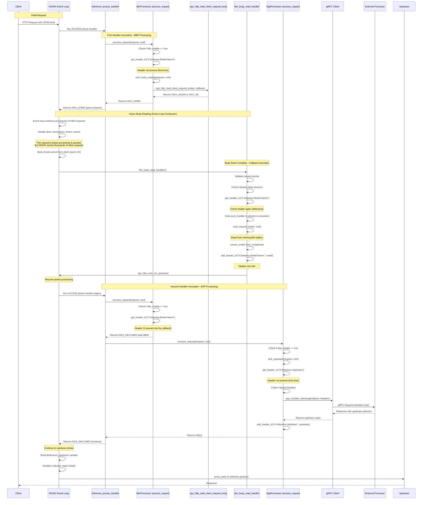

# Event Loop Flow Diagram

This diagram illustrates the NGINX event loop flow when both BBR (Body-Based Routing) and EPP (Endpoint Picker Processor) are enabled.

## Key Functions and Flow

### First Handler Invocation (BBR)
1. **`inference_access_handler`** - ACCESS phase handler entry point
2. **`BbrProcessor::process_request()`** - Check if BBR needed
3. **`BbrProcessor::start_body_reading()`** - Initiate async body read
4. **`ngx_http_read_client_request_body()`** - NGINX FFI to read body
5. Returns **`NGX_DONE`** to pause phase processing

### Async Body Processing (Callback)
6. **`bbr_body_read_handler()`** - Called when body is ready
7. **`read_request_body()`** - Extract body from buffers
8. **`extract_model_from_body()`** - Parse JSON for model name
9. **`add_header_in()`** - Set `X-Gateway-Model-Name` header
10. **`ngx_http_core_run_phases()`** - Resume NGINX phase processing

### Second Handler Invocation (EPP)
11. **`inference_access_handler`** - Same handler called again
12. **`BbrProcessor::process_request()`** - Checks header, returns `NGX_DECLINED`
13. **`EppProcessor::process_request()`** - Check if EPP needed
14. **`EppProcessor::pick_upstream()`** - Contact external processor
15. **`crate::grpc::epp_headers_blocking()`** - Blocking gRPC call
16. **`add_header_in()`** - Set `X-Inference-Upstream` header
17. Returns **`NGX_DECLINED`** to continue normal processing

### Variable Evaluation
18. **`inference_upstream_var_get()`** - Evaluates `$inference_upstream` variable
19. Reads from `X-Inference-Upstream` header set by EPP

## Important Notes

- **Event loop is NOT paused**: When BBR returns `NGX_DONE`, only THIS request's phase processing pauses. The NGINX event loop continues running, serving other requests and handling other events. This is why NGINX can handle thousands of concurrent connections efficiently.

- **BBR is async**: Returns `NGX_DONE` to yield control back to NGINX event loop. The request body is read asynchronously using non-blocking I/O. NGINX can process other requests while waiting for body chunks to arrive.

- **EPP is sync/blocking**: Makes a blocking gRPC call but completes within the same handler invocation. This means EPP will block the worker process for this request until the gRPC call completes (typically ~200ms or configured timeout).

- **Request-specific pause**: Only the specific request waiting for body reading has its phase processing paused. Other requests continue through their phases normally.

- **Handler runs twice**: The same `inference_access_handler` is invoked twice for the same request - once before body reading (BBR starts async read), and once after (BBR self-skips, EPP executes).

- **Phase resumption**: `ngx_http_core_run_phases()` is the critical function that resumes phase processing for the specific request after the async body read completes.

- **Defensive checks**: Both BBR callback and process_request check for header presence to prevent duplicate processing if the handler is somehow invoked again.
