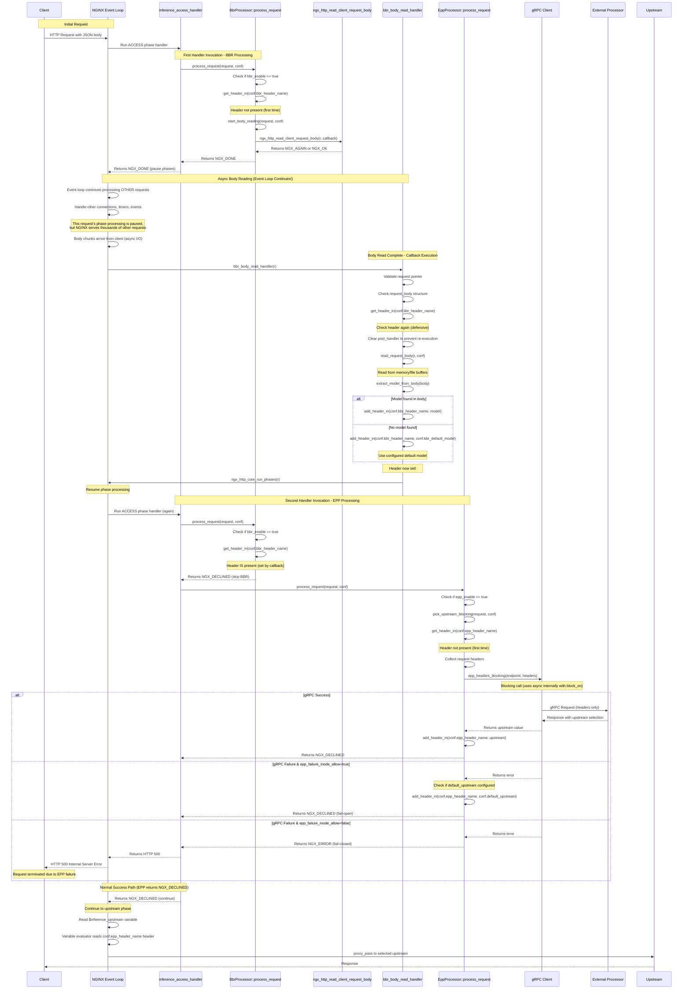

# Event Loop Flow Diagram

This diagram illustrates the NGINX event loop flow when both BBR (Body-Based Routing) and EPP (Endpoint Picker Processor) are enabled.

## Key Functions and Flow

### First Handler Invocation (BBR)
1. **`inference_access_handler`** - ACCESS phase handler entry point
2. **`BbrProcessor::process_request()`** - Check if BBR needed
3. **`BbrProcessor::start_body_reading()`** - Initiate async body read
4. **`ngx_http_read_client_request_body()`** - NGINX FFI to read body
5. Returns **`NGX_DONE`** to pause phase processing

### Async Body Processing (Callback)
6. **`bbr_body_read_handler()`** - Called when body is ready
7. **`read_request_body()`** - Extract body from buffers
8. **`extract_model_from_body()`** - Parse JSON for model name
9. **`add_header_in()`** - Set configurable BBR header (default: `X-Gateway-Model-Name`) with extracted model or default model if none found
10. **`ngx_http_core_run_phases()`** - Resume NGINX phase processing

### Second Handler Invocation (EPP)
11. **`inference_access_handler`** - Same handler called again
12. **`BbrProcessor::process_request()`** - Checks header, returns `NGX_DECLINED`
13. **`EppProcessor::process_request()`** - Check if EPP needed
14. **`EppProcessor::pick_upstream_blocking()`** - Contact external processor (blocking)
15. **`crate::grpc::epp_headers_blocking()`** - Blocking gRPC call (async internally)
16. **Error handling**: On success, sets configurable EPP header and returns `NGX_DECLINED`; on failure with `epp_failure_mode_allow=false`, returns `NGX_ERROR` (causing HTTP 500); on failure with `epp_failure_mode_allow=true`, may set default_upstream and returns `NGX_DECLINED`
17. **Handler response**: Returns **`NGX_DECLINED`** on success/fail-open, or **HTTP 500** on fail-closed EPP errors

### Variable Evaluation
18. **`inference_upstream_var_get()`** - Evaluates `$inference_upstream` variable
19. Reads from configurable EPP header (default: `X-Inference-Upstream`) set by EPP or default upstream fallback

## Important Notes

- **Event loop is NOT paused**: When BBR returns `NGX_DONE`, only THIS request's phase processing pauses. The NGINX event loop continues running, serving other requests and handling other events. This is why NGINX can handle thousands of concurrent connections efficiently.

- **BBR is async**: Returns `NGX_DONE` to yield control back to NGINX event loop. The request body is read asynchronously using non-blocking I/O. NGINX can process other requests while waiting for body chunks to arrive.

- **EPP is blocking**: Uses synchronous gRPC calls via `epp_headers_blocking()`. While the gRPC internals use async operations with `tokio::runtime::block_on()`, the NGINX interface remains blocking and respects the single-threaded event loop model. This is simpler and more reliable than async callbacks.

- **EPP failure modes**: EPP supports two failure modes via `epp_failure_mode_allow` directive:
  - **Fail-closed** (`epp_failure_mode_allow off`): EPP failures return `NGX_ERROR`, causing the main handler to return HTTP 500
  - **Fail-open** (`epp_failure_mode_allow on`): EPP failures return `NGX_DECLINED` and may set `default_upstream` if configured, allowing request processing to continue

- **Request-specific pause**: Only the specific request waiting for body reading has its phase processing paused. Other requests continue through their phases normally.

- **Handler runs twice**: The same `inference_access_handler` is invoked twice for the same request - once before body reading (BBR starts async read), and once after (BBR self-skips, EPP executes).

- **Phase resumption**: `ngx_http_core_run_phases()` is the critical function that resumes phase processing for the specific request after the async body read completes.

- **Defensive checks**: Both BBR callback and process_request check for header presence to prevent duplicate processing if the handler is somehow invoked again.

- **Configurable headers**: Both BBR and EPP header names are configurable via `inference_bbr_header_name` and `inference_epp_header_name` directives, defaulting to `X-Gateway-Model-Name` and `X-Inference-Upstream` respectively.

- **Default model handling**: When BBR cannot extract a model from the request body, it uses the configured `bbr_default_model` value to prevent reprocessing and ensure consistent behavior.

- **EPP error handling**: EPP failures are handled according to `epp_failure_mode_allow` setting. In fail-closed mode, EPP errors terminate the request with HTTP 500. In fail-open mode, EPP errors allow the request to continue, optionally using `default_upstream` if configured.

- **Request termination**: Unlike BBR which always allows requests to continue (possibly with default model), EPP can terminate requests early if `epp_failure_mode_allow=false` and the external processor is unavailable.
