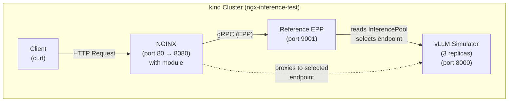

# Reference EPP Testing with Kind

This directory contains a comprehensive test suite for validating the ngx-inference module against the **real reference EPP** (Endpoint Picker Processor) from the Gateway API Inference Extension project.

## Overview

Unlike the Docker-based tests that use a mock EPP and echo-server, this test suite:
- Deploys a real Kubernetes cluster using kind
- Runs a vLLM simulator (lightweight testing backend)
- Installs the reference EPP via Helm (from the Gateway API Inference Extension project)
- Tests all configurations directly against vLLM for consistent inference validation
- Provides enhanced TLS error logging for certificate validation issues

This provides realistic validation of the module's compatibility with the Gateway API Inference Extension specification.

## Architecture



## Quick Start

### Prerequisites

Ensure you have the following tools installed:
- **kind** - Kubernetes in Docker
- **kubectl** - Kubernetes CLI
- **helm** - Kubernetes package manager
- **docker** - Container runtime
- **curl** and **jq** - For testing

### One-Command Setup

```bash
# From the project root
./tests/kind-ngf/scripts/setup.sh
```

**Optional**: Customize chart version:
```bash
export IGW_CHART_VERSION="v1.1.0"  # Default: v1.1.0
./tests/kind-ngf/scripts/setup.sh
```

This automated script will:
1. Create a kind cluster
2. Build the NGINX image with the ngx-inference module
3. Load the image into the cluster
4. Deploy the vLLM simulator (lightweight testing backend)
5. Install the reference EPP via Helm
6. Deploy NGINX with the module

### Run Tests

```bash
./tests/kind-ngf/scripts/test-kind.sh
# Or using make
make test-kind
```

The test suite runs **all six configuration scenarios** automatically:
- **BBR ON + EPP OFF**: Model extraction only
- **BBR OFF + EPP ON**: Endpoint selection only  
- **BBR ON + EPP ON**: Both features enabled
- **BBR OFF + EPP OFF**: Direct proxy (baseline)
- **EPP Untrusted TLS (Allow)**: TLS certificate validation with fail-open mode
- **EPP Untrusted TLS (Deny)**: TLS certificate validation with fail-closed mode

Each scenario is tested by:
1. Generating the appropriate NGINX configuration using `generate-config.sh`
2. Applying it to the cluster via ConfigMap
3. Restarting NGINX to pick up the new config
4. Running scenario-specific tests

This provides comprehensive validation that matches the existing Docker/local test matrix.

## Manual Setup (Step-by-Step)

If you prefer manual control or need to troubleshoot:

### 1. Create the Kind Cluster

```bash
kind create cluster --config tests/kind-ngf/cluster/kind-config.yaml
```

### 2. Build and Load the NGINX Image

```bash
# Build the image
docker build -f docker/nginx/Dockerfile -t ngx-inference:latest .

# Load into kind
kind load docker-image ngx-inference:latest --name ngx-inference-test
```

### 3. Deploy Base Components

```bash
# Create namespace
kubectl apply -f tests/kind-ngf/manifests/01-namespace.yaml

# Install vLLM via Helm (recommended)
helm repo add vllm https://vllm-project.github.io/vllm-helm-chart
helm repo update

helm install vllm-llama3-8b-instruct vllm/vllm \
  --namespace ngx-inference-test \
  --create-namespace \
  --version v1.1.0 \
  --set model="meta-llama/Meta-Llama-3-8B-Instruct" \
  --set service.type=ClusterIP \
  --set service.port=8000 \
  --set env[0].name=HF_TOKEN \
  --set env[0].value="${HF_TOKEN}" \
  --wait --timeout 10m


# Wait for vLLM to be ready (this can take several minutes)
kubectl wait --for=condition=ready pod -l app.kubernetes.io/name=vllm \
  -n ngx-inference-test --timeout=600s
```

### 4. Install Reference EPP

The reference EPP is installed via Helm from the Gateway API Inference Extension project:

```bash
# Install the InferencePool chart from OCI registry
helm install vllm-llama3-8b-instruct \
  oci://registry.k8s.io/gateway-api-inference-extension/charts/inferencepool \
  --namespace ngx-inference-test \
  --set inferencePool.modelServers.matchLabels.app=vllm-llama3-8b-instruct \
  --set provider.name=reference-epp \
  --version 0.1.0
```

**Note**: If the Helm chart is not yet published, you can manually apply the InferencePool manifest:

```bash
kubectl apply -f tests/kind-ngf/manifests/03-inferencepool.yaml
```

### 5. Deploy NGINX with Module

The setup script now generates NGINX configurations dynamically using `generate-config.sh` (just like local/docker tests):

```bash
# The setup.sh script handles this automatically, but if doing manually:

# Generate initial config
./tests/generate-config.sh -e kind -o /tmp/nginx-kind.conf -s bbr_on_epp_on -n ngx-inference-test

# Create ConfigMap
kubectl create configmap nginx-inference-bbr_on_epp_on \
  --from-file=nginx.conf=/tmp/nginx-kind.conf \
  -n ngx-inference-test

# Create Service and Deployment (see setup.sh for full YAML)
# The deployment references the ConfigMap for configuration
```

**Note**: Each test scenario creates its own unique ConfigMap (e.g., `nginx-inference-bbr_on_epp_on`, `nginx-inference-bbr_off_epp_on`), which remain in the cluster for inspection after tests complete.

## Testing

### Automated Test Matrix

```bash
./tests/kind-ngf/scripts/test-kind.sh
# Or using make
make test-kind
```

This runs the complete test matrix across all six configuration scenarios:

| Scenario | BBR | EPP | Tests |
|----------|-----|-----|-------|
| bbr_on_epp_off | ✓ | ✗ | Model extraction, direct routing |
| bbr_off_epp_on | ✗ | ✓ | Endpoint selection via reference EPP |
| bbr_on_epp_on | ✓ | ✓ | Both BBR + EPP active |
| bbr_off_epp_off | ✗ | ✗ | Baseline (no processing) |
| bbr_off_epp_on_untrusted_tls_allow | ✗ | ✓ | EPP with untrusted TLS (fail-open) |
| bbr_off_epp_on_untrusted_tls_deny | ✗ | ✓ | EPP with untrusted TLS (fail-closed) |

Each scenario validates:
1. NGINX health check
2. Configuration-appropriate endpoint testing
3. Header inspection and verification
4. Proper behavior for enabled/disabled features

### Manual Testing

#### Health Check
```bash
curl http://localhost:8080/health
```

#### Direct vLLM Access (No EPP)
```bash
curl -X POST http://localhost:8080/v1/completions \
  -H 'Content-Type: application/json' \
  -d '{
    "model": "meta-llama/Meta-Llama-3-8B-Instruct",
    "prompt": "Hello",
    "max_tokens": 5
  }'
```

#### EPP-Enabled Endpoint
```bash
curl -X POST http://localhost:8080/v1/chat/completions \
  -H 'Content-Type: application/json' \
  -d '{
    "model": "meta-llama/Meta-Llama-3-8B-Instruct",
    "messages": [{"role": "user", "content": "Hello"}],
    "max_tokens": 5
  }'
```

## Debugging

### View Logs

```bash
# NGINX logs (shows EPP communication)
kubectl logs -n ngx-inference-test -l app=nginx-inference -f

# vLLM logs
kubectl logs -n ngx-inference-test -l app=vllm-llama3-8b-instruct -f

# Reference EPP logs
kubectl logs -n ngx-inference-test -l app.kubernetes.io/name=reference-epp -f
```

### Check Pod Status

```bash
kubectl get pods -n ngx-inference-test -o wide
```

### Describe Resources

```bash
# NGINX pod
kubectl describe pod -n ngx-inference-test -l app=nginx-inference

# InferencePool
kubectl describe inferencepool -n ngx-inference-test vllm-llama3-8b-instruct

# Reference EPP deployment
kubectl describe deployment -n ngx-inference-test -l app.kubernetes.io/name=reference-epp
```

### Access NGINX Shell

```bash
kubectl exec -it -n ngx-inference-test \
  $(kubectl get pod -n ngx-inference-test -l app=nginx-inference -o jsonpath='{.items[0].metadata.name}') \
  -- /bin/sh
```

## Configuration

### NGINX Configuration

NGINX configurations are now **generated dynamically** using `generate-config.sh`, just like local and docker tests:
- Starts from `tests/configs/nginx-base.conf` template
- Applies scenario-specific configs from `tests/configs/*.conf`
- Environment-specific settings (kind, local, docker) are automatically applied
- Each test scenario creates its own ConfigMap for later inspection

**Dynamic Configuration Benefits**:
- Consistent with local/docker test workflows
- Easier to maintain (single source of truth)
- Automatic handling of endpoints, TLS, resolver settings
- Each test scenario preserves its ConfigMap for debugging

**View Generated Configs**:
```bash
# List all scenario-specific ConfigMaps
kubectl get configmap -n ngx-inference-test | grep nginx-inference

# View a specific scenario's config
kubectl get configmap nginx-inference-bbr_on_epp_on -n ngx-inference-test -o yaml

# View the currently active config
kubectl exec -n ngx-inference-test -l app=nginx-inference -- cat /etc/nginx/nginx.conf
```

**Manually Generate a Config**:
```bash
# Generate a specific scenario config
./tests/generate-config.sh -e kind -o /tmp/my-config.conf -s bbr_off_epp_on -n ngx-inference-test

# View the generated config
cat /tmp/my-config.conf
```

**Apply a New Configuration**:
The test script handles this automatically, but if doing manually:
```bash
# Generate config
./tests/generate-config.sh -e kind -o /tmp/nginx-test.conf -s bbr_on_epp_off -n ngx-inference-test

# Create/update ConfigMap
kubectl create configmap nginx-inference-bbr_on_epp_off \
  --from-file=nginx.conf=/tmp/nginx-test.conf \
  -n ngx-inference-test \
  --dry-run=client -o yaml | kubectl apply -f -

# Update deployment to use new ConfigMap
kubectl patch deployment nginx-inference -n ngx-inference-test --type=json \
  -p='[{"op": "replace", "path": "/spec/template/spec/volumes/0/configMap/name", "value": "nginx-inference-bbr_on_epp_off"}]'
```

### vLLM Simulator Configuration

The vLLM simulator is a lightweight testing backend deployed via YAML manifest:
- **Image**: `ghcr.io/llm-d/llm-d-inference-sim:v0.5.0`
- **Replicas**: 3 (for EPP load balancing tests)
- **Service**: ClusterIP on port 8000
- **Resources**: Minimal (10m CPU, 64Mi memory)
- **Purpose**: Simulates vLLM API responses without model overhead

**Benefits**:
- Fast startup (seconds vs minutes)
- No model downloads required
- No HuggingFace token needed
- Minimal resource usage
- Sufficient for testing EPP endpoint selection

**Note**: The simulator provides mock responses and is not suitable for actual inference testing. For production validation with real models, use the full vLLM deployment (see commented sections in setup.sh).

### InferencePool Configuration

The InferencePool resource tells the reference EPP which pods to select:
```yaml
spec:
  modelServers:
    matchLabels:
      app: vllm-llama3-8b-instruct
  provider:
    name: reference-epp
```

## Cleanup

### Delete the Cluster

```bash
kind delete cluster --name ngx-inference-test
```

### Remove Docker Images (Optional)

```bash
docker rmi ngx-inference:latest
```

## Troubleshooting

### vLLM Simulator Not Ready

**Issue**: vLLM simulator pods are not ready

**Solutions**:
- Check pod status: `kubectl get pods -n ngx-inference-test -l app=vllm-llama3-8b-instruct`
- View pod logs: `kubectl logs -n ngx-inference-test -l app=vllm-llama3-8b-instruct`
- The simulator is lightweight and should start quickly (within 30 seconds)
- Check if image pull is failing: `kubectl describe pod -n ngx-inference-test -l app=vllm-llama3-8b-instruct`

### EPP Returns 502/500 Errors

**Issue**: Tests fail with 502 or 500 errors from EPP endpoints

**Root Cause**: The EPP cannot find any backend pods to select.

**Solutions**:
- Verify backend pods exist: `kubectl get pods -n ngx-inference-test -l app=vllm-llama3-8b-instruct`
  - Should show 3 simulator pods in Running state
- Check InferencePool configuration: `kubectl get inferencepool vllm-llama3-8b-instruct -n ngx-inference-test -o yaml`
  - Verify `selector.matchLabels.app` is set to `vllm-llama3-8b-instruct`
- Verify EPP is discovering the backends: `kubectl logs -n ngx-inference-test -l inferencepool=vllm-llama3-8b-instruct-epp`
  - Look for logs about endpoint selection

### Reference EPP Not Found

**Issue**: EPP pod doesn't exist or Helm install failed

**Solutions**:
- The Helm chart may not be published yet (it's under development)
- Manually apply the InferencePool: `kubectl apply -f tests/kind-ngf/manifests/03-inferencepool.yaml`
- Check if the CRD exists: `kubectl get crd inferencepools.gateway.networking.k8s.io`

### NGINX Can't Reach EPP

**Issue**: NGINX logs show gRPC connection errors to EPP

**Solutions**:
- Verify EPP service exists: `kubectl get svc -n ngx-inference-test reference-epp`
- Check EPP pod status: `kubectl get pods -n ngx-inference-test -l app.kubernetes.io/name=reference-epp`
- Verify DNS resolution from NGINX pod:
  ```bash
  kubectl exec -n ngx-inference-test -l app=nginx-inference -- \
    nslookup reference-epp.ngx-inference-test.svc.cluster.local
  ```

### Port Already in Use

**Issue**: Port 8080 is already in use

**Solutions**:
- Check what's using the port: `lsof -i :8080`
- Modify `kind-config.yaml` to use a different host port
- Or stop the conflicting service

## Comparison with Docker Tests

| Aspect | Docker Tests | Kind Tests |
|--------|-------------|-----------|
| EPP | Mock implementation | Real reference EPP |
| Backend | Echo server | vLLM Simulator |
| Environment | Docker Compose | Kubernetes cluster |
| Test Matrix | ✓ 4 basic scenarios | ✓ 6 scenarios (incl. TLS) |
| Config Method | File replacement | ConfigMap + rollout |
| Setup Time | ~1 minute | ~2 minutes |
| Resource Usage | Low | Low |
| Installation | Docker build | Helm charts |
| Realism | Basic validation | Production-like |
| Use Case | Quick iteration | Integration validation |

## Makefile Integration

You can also use Make targets:

```bash
# Setup the cluster
make test-kind-setup

# Run tests
make test-kind

# Cleanup
make test-kind-cleanup
```

## Test Implementation

The kind tests reuse the existing test infrastructure:

- **Config Generation**: Uses `tests/generate-config.sh` with `-e kind` flag
- **Config Files**: Reuses `tests/configs/*.conf` server configurations
- **Test Logic**: Adapts test patterns from `tests/test-config.sh`
- **Scenarios**: Same BBR ON/OFF + EPP ON/OFF matrix as other test suites

This ensures consistency across all test environments and reduces code duplication.

## Future Enhancements

- [ ] Support for multiple model backends
- [ ] Gateway API HTTPRoute integration
- [ ] Performance benchmarking with real workloads
- [ ] Stress testing with concurrent requests
- [ ] Large payload testing (like BBR large body tests)
- [ ] NGINX Gateway Fabric integration (when module support is added)

## Related Documentation

- [Gateway API Inference Extension](https://github.com/kubernetes-sigs/gateway-api-inference-extension)
- [Reference EPP Implementation](https://github.com/kubernetes-sigs/gateway-api-inference-extension/tree/main/pkg/epp)
- [NGX-Inference Module Configuration](../../docs/configuration.md)
- [Docker-based Tests](../README.md)
